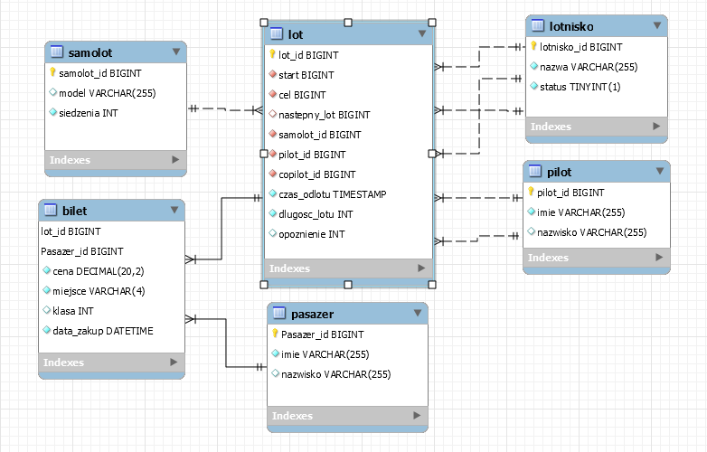

# Dokumentacja Bazy Danych Linii Lotniczych

Mateusz Mazurek, Hubert Wasilewski, Jakub Sobieraj 5pr
[Link do dokumentu Google](https://docs.google.com/document/d/1Sb_rlGnyOS_Pu1ZKi9VG5PpfJrneGZrRBVxkUwpjg1s/edit?usp=sharing)

## Schemat `public`

Baza danych przechowuje informacje o lotniskach, samolotach, pilotach, lotach,
pasażerach i biletach. Poniżej przedstawiono szczegółowy opis tabel w schemacie
`public`.

### Tabela `lotnisko`

Przechowuje informacje na temat lotnisk.

- **lotnisko_id**: Unikatowy identyfikator lotniska (klucz główny).
- **nazwa**: Nazwa lotniska.
- **czynny**: Status operacyjny lotniska (otwarte/zamknięte).

### Tabela `samolot`

Przechowuje dane o samolotach wykorzystywanych przez linię lotniczą.

- **samolot_id**: Unikatowy identyfikator samolotu (klucz główny).
- **model**: Model samolotu.
- **miejsca**: Liczba dostępnych miejsc w samolocie.

### Tabela `pilot`

Zawiera informacje o pilotach zatrudnionych przez linię.

- **pilot_id**: Unikatowy identyfikator pilota (klucz główny).
- **imie**: Imię pilota.
- **nazwisko**: Nazwisko pilota.

### Tabela `lot`

Odzwierciedla pojedyncze loty realizowane między lotniskami.

- **lot_id**: Identyfikator danego lotu (klucz główny).
- **pochodzenie**: Lotnisko pochodzenia.
- **kierunek**: Lotnisko docelowe.
- **nastepny_lot**: Opcjonalne powiązanie z kolejnym planowanym lotem.
- **samolot_id**: Przypisanie samolotu do danego lotu.
- **pilot_id &amp; drugi_pilot_id**: Identyfikatory przypisanych pilotów
  pierwszego i drugiego oficera. Nie mogą być tacy sami dla jednego rejsu
- **data_odlotu**: Planowana data oraz godzina odlotu
- **dlugosc_lotu**: Przewidywana długość trwania rejsu
- **opoznienia**: Ewentualne opóźnenia względem planowanego czasu

**Ograniczenia**

- Źródło i cel nie mogą być takie same
- Pilot i drugi pilot muszą być różnymi osobami

### Tabela `pasazer`

Informacje na temat pasażerów korzystających z usług linii.

- **pasazer_id** : Numer identyfikacyjny pasażera
- **imie**, nazwisko : Dane personalne pasażera

### Tabela `bilet`

Dane odnośnie zakupionych biletów na określone rejsy.

- **lot_ID &amp; pasazer_Id**: Klucze obce połączone relacją jeden-do-wielu
  odpowiednio z tabelą LOT oraz Pasazer, te pola tworzą razem klucz głowney
- **cena** : Cena biletu musi byc nieujemna
- **miejsce**: Numer miejsca przypisanego pasażerowi na pokładzie
- **klasa** : Klasa ekonomiczna/biznes/first class itd.
- **data_zakupu**: Timestamp zawierający datę oraz godzinę zakupienia
  biletuParametry są ustawione tak aby dokumentować transakcję automatycznie

Kontrola spójności danych jest zapewniona przez ograniczenia klucza obcego
(`foreign key`) oraz klucza głównego (`primary key`). Ponadto w tabeli użyto
ograniczeń typowych dla danej domeny problemowej jak np. kontrolowanie
negatywności cen czy duplikacji osoby pełniącej rolę pilota.
